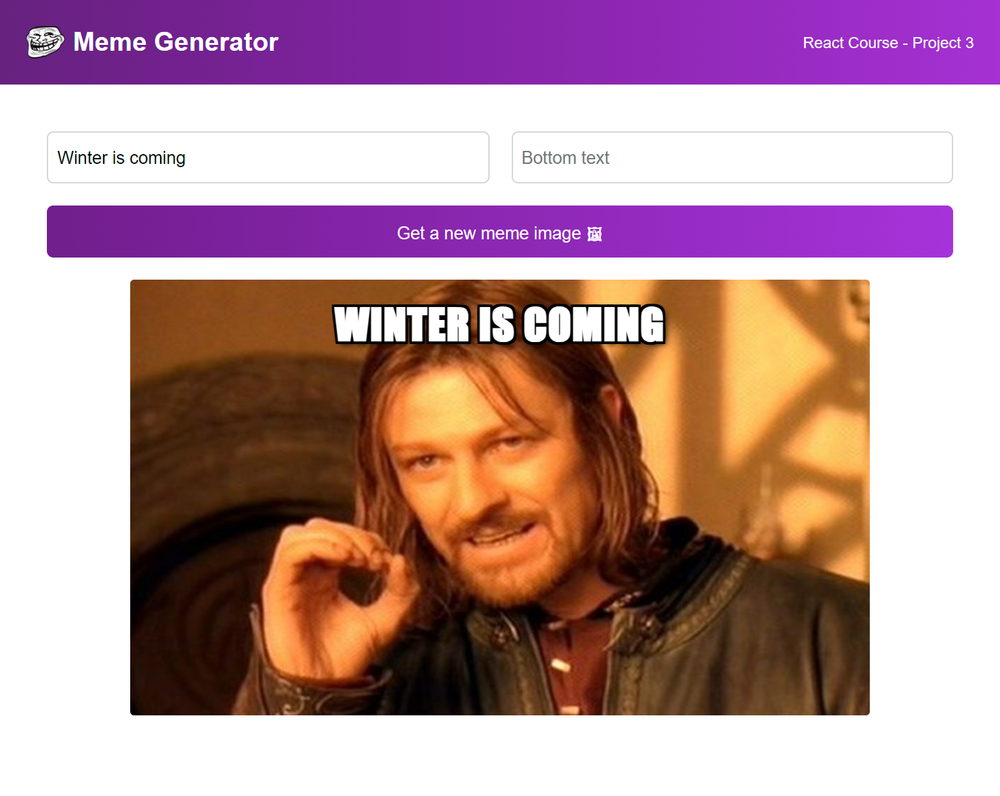

# Meme Generator 😆

## Project Overview

The **Meme Generator** is a fun, interactive web app built with **React** that lets users create their own memes. You can select random meme images and add custom top and bottom text to generate your personalized meme. This project was created to practice API fetching, useEffect, and state management in React.

## 🚀 Features

- **Random Meme Images**: Fetches meme images from the **Imgflip API**, allowing users to generate random memes.
- **Customizable Text**: Users can add custom top and bottom text to their selected meme image.
- **Dynamic Meme Preview**: As users input text, the meme image updates in real-time.
- **Responsive Design**: The layout is optimized for different screen sizes.

## 🛠️ Technologies Used

- **React**: JavaScript library for building user interfaces.
- **Imgflip API**: Fetches random meme images from the API.
- **useState & useEffect**: For managing meme image state and API calls.
- **CSS**: For styling the app.

## API Used

- **Imgflip API**: Fetches meme data, including images and relevant meme info.

## What I Learned

This project helped me gain hands-on experience with:

- **API Integration**: Fetching and handling external data with Fetch API.
- **React State Management**: Using `useState` to manage input fields and image selection.
- **useEffect**: Handling side effects and managing API calls within React.
- **CSS Styling**: Creating a responsive and fun user interface.

## Live Demo

[View Live Meme Generator](https://meme-project-claudio.netlify.app/)

## Repository

[GitHub Repository](https://github.com/claudiooleite/meme-generator) <!-- Replace with actual link -->

## Screenshots

### Meme Generator View

 <!-- Replace with actual image path -->
